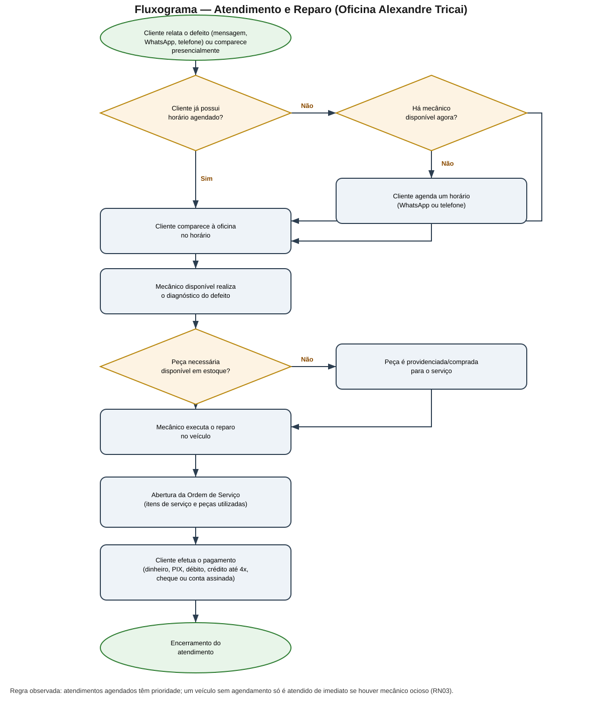
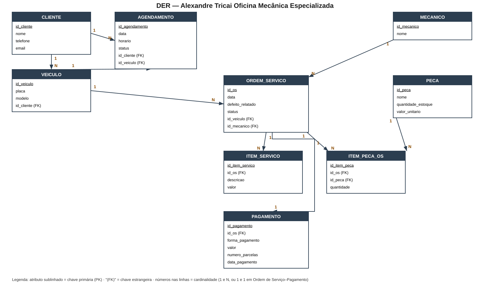

# Entrega 1 — Modelo Conceitual (DER)
### Modelagem de um sistema de gestão de informações para uma organização de pequeno porte

---

# Título
Modelagem de Banco de Dados para a Oficina Mecânica Alexandre Tricai — Especializada em Vans Mercedes-Benz Sprinter CDI

## Introdução

A Oficina Mecânica Alexandre Tricai é uma oficina de pequeno porte, localizada em Suzano-SP, especializada na manutenção de vans Mercedes-Benz (linha Sprinter CDI), atendendo principalmente empresas de transporte de passageiros e fretamento. Atualmente a oficina não utiliza nenhum sistema de informação: o cadastro de clientes é feito manualmente a cada nova ordem de serviço em talão de papel, o controle de estoque de peças é mantido apenas pela organização física nas prateleiras (sem registro de quantidades), e os agendamentos são combinados informalmente por WhatsApp ou telefone, sem nenhum registro central.

**Objetivo:** este trabalho tem como objetivo levantar os processos, requisitos e regras de negócio da oficina e propor um Modelo Conceitual de banco de dados — representado por um Diagrama Entidade-Relacionamento (DER) — capaz de organizar o cadastro de clientes e veículos, as ordens de serviço, o controle de estoque de peças, os agendamentos e os pagamentos.

**Delimitação:** o escopo desta entrega é conceitual. Não serão tratados aqui o projeto físico do banco (tipos de dados, índices, SQL) nem a implementação de um sistema — apenas o levantamento de requisitos, regras de negócio e a modelagem conceitual (entidades, atributos, relacionamentos e cardinalidades).

## Desenvolvimento

### Caracterização da Organização
*(vale 7,5% — Dimensão Conceitual)*

- **Nome e natureza da organização:** Alexandre Tricai - Oficina Mecânica Especializada, empresa com fins lucrativos, CNPJ 14.855.257/0001-30, especializada em manutenção de vans Mercedes-Benz Sprinter CDI.
- **Contexto e porte:** oficina de pequeno porte, com fins lucrativos. Conta com 4 a 5 pessoas envolvidas (proprietário e mecânicos), todos registrados de forma informal, sem sistema de RH. O volume de atividade é de atendimentos diários de diagnóstico, revisão e reparo de vans, com emissão de uma ordem de serviço por atendimento.
- **Problemas e necessidades identificados:** a oficina não possui nenhum sistema informatizado. O cadastro de cliente e veículo é refeito manualmente em talão de papel a cada nova ordem de serviço, não havendo histórico consultável de manutenções por cliente ou por veículo. O estoque de peças (filtros, pastilhas de freio, componentes de motor, etc.) é organizado fisicamente em prateleiras, mas sem controle de quantidade ou registro de saída por serviço. Os agendamentos são combinados por WhatsApp ou telefone, sem registro único, o que gera risco de conflito de horários entre mecânicos.
- **Justificativa da escolha:** a oficina foi escolhida por ser uma organização real, de porte pequeno e de fácil acesso para o grupo, com processos claros o suficiente para gerar entidades e regras de negócio relevantes (clientes, veículos, ordens de serviço, peças, pagamentos, agendamentos), sem a complexidade de uma operação de grande porte.
- **Evidências da organização:**
  - Endereço completo: Av. Miguel Badra, 782 — Cidade Boa Vista, Suzano/SP.
  - Contato: (11) 99778-1502 (WhatsApp/celular) e (11) 4752-6266 (fixo).
  - Foto do modelo físico de Ordem de Serviço utilizado atualmente, com nome da oficina, CNPJ e endereço: [`evidencias/ordem-servico-modelo.jpg`](evidencias/ordem-servico-modelo.jpg)
  - Foto do letreiro/mural externo da oficina, indicando a especialização em Sprinter CDI: [`evidencias/fachada-letreiro.jpg`](evidencias/fachada-letreiro.jpg)
  - Foto da visita de campo do grupo com o proprietário, dentro da oficina: [`evidencias/equipe-oficina.jpg`](evidencias/equipe-oficina.jpg)
  - Foto do estoque de peças organizado nas prateleiras: [`evidencias/estoque-pecas.jpg`](evidencias/estoque-pecas.jpg)
  - Foto do galpão com veículos de clientes em manutenção: [`evidencias/galpao-vans-clientes.jpg`](evidencias/galpao-vans-clientes.jpg)

---

### Processos de Negócio
*(vale 10% — Dimensão Procedimental)*

- **Principais processos mapeados:**
  - Cadastro de cliente e veículo (feito no momento da abertura da ordem de serviço).
  - Agendamento de horário de atendimento.
  - Atendimento e diagnóstico do defeito.
  - Execução do reparo/serviço, com uso de peças do estoque.
  - Abertura e fechamento da Ordem de Serviço.
  - Pagamento do serviço.

**Fluxo textual do processo principal (Atendimento e Reparo):**

```text
Cliente relata o defeito (mensagem/WhatsApp/telefone) ou comparece presencialmente
↓
Caso haja contato prévio → cliente agenda um horário
  (caso apareça sem agendamento e haja mecânico disponível → é atendido na hora)
↓
Cliente comparece à oficina no horário combinado
↓
Mecânico disponível realiza o diagnóstico do defeito
↓
Mecânico executa o reparo
  (utiliza peça do estoque, ou a peça é providenciada para o serviço)
↓
Abertura da Ordem de Serviço (registra cliente, veículo, itens/serviços executados e produtos utilizados)
↓
Cliente efetua o pagamento (dinheiro, PIX, cartão de débito, cartão de crédito — podendo ser parcelado em até 4x —, cheque ou conta assinada)
```

Regra de prioridade observada: atendimentos agendados têm prioridade; um veículo sem agendamento prévio só é atendido imediatamente se houver mecânico ocioso no momento.

- **Fluxograma:**



---

### Requisitos do Sistema
*(esta seção e a Seção 4 "Regras de Negócio" DIVIDEM 7,5% na dimensão conceitual — juntas valem 7,5%, não 7,5% cada — + 4% exclusivos desta seção na organização/documentação)*

#### Requisitos Funcionais
- RF01 — O sistema deve permitir cadastrar clientes e seus veículos.
- RF02 — O sistema deve permitir registrar ordens de serviço, vinculando cliente, veículo, mecânico responsável, itens de serviço executados e peças utilizadas.
- RF03 — O sistema deve permitir agendar horários de atendimento.
- RF04 — O sistema deve permitir consultar a disponibilidade de horários e de mecânicos.
- RF05 — O sistema deve permitir registrar o pagamento de uma ordem de serviço, com forma de pagamento (dinheiro, PIX, débito, crédito — parcelável em até 4x —, cheque ou conta assinada).
- RF06 — O sistema deve permitir controlar o estoque de peças (entrada e saída por ordem de serviço).
- RF07 — O sistema deve permitir consultar o histórico de ordens de serviço de um cliente ou de um veículo específico.

#### Requisitos Não Funcionais
- RNF01 — O sistema deve restringir o acesso por usuário e senha.
- RNF02 — O sistema deve proteger os dados cadastrais dos clientes.
- RNF03 — O sistema deve ter interface simples e objetiva, considerando que a equipe não tem familiaridade prévia com sistemas informatizados.
- RNF04 — As consultas (histórico de veículo, disponibilidade de horário, estoque) devem responder rapidamente, mesmo em dispositivos simples (celular/tablet).

---

### Regras de Negócio
*(esta seção DIVIDE com a Seção 3 "Requisitos do Sistema" os mesmos 7,5% da dimensão conceitual — juntas valem 7,5%, não 7,5% cada — + 4% exclusivos desta seção na documentação. "Regras de negócio" é o termo técnico usado em modelagem de dados para as regras de funcionamento de qualquer organização, com ou sem fins lucrativos)*

- **Regras operacionais:**
  - RN01 — Uma ordem de serviço deve estar associada a exatamente um cliente e um veículo.
  - RN02 — Um mecânico não pode estar alocado a dois atendimentos no mesmo horário.
  - RN03 — Um atendimento agendado tem prioridade sobre um atendimento sem agendamento prévio, salvo se houver mecânico ocioso no momento.
  - RN04 — Um pagamento deve estar relacionado a exatamente uma ordem de serviço e pode ser dividido em até 4 parcelas quando a forma de pagamento for cartão de crédito.
  - RN05 — Uma peça só pode ser utilizada em uma ordem de serviço se houver quantidade disponível em estoque.
  - RN06 — Um veículo pode ter várias ordens de serviço ao longo do tempo, compondo seu histórico de manutenção.
- **Restrições organizacionais:**
  - A oficina atende exclusivamente vans Mercedes-Benz (linha Sprinter CDI), o que limita o escopo do cadastro de veículos a essa marca/linha.
  - Os mecânicos são registrados de forma informal (sem vínculo formalizado em sistema de RH), o que é suficiente para o escopo deste modelo, mas limita, por ora, controles como jornada de trabalho ou escala.

---

### Dicionário de Dados Conceitual (Preliminar)
*(vale 10% — Dimensão Procedimental)*

*(Todos os valores de exemplo abaixo são fictícios, apenas para ilustrar o tipo de dado — não representam clientes ou veículos reais.)*

**Entidade: CLIENTE**

| Atributo | Descrição | Regra de negócio associada |
|----------|-----------|------------------------------|
| id_cliente | Identificador único do cliente | Obrigatório e único |
| nome | Nome do cliente ou razão social da empresa de transporte | Obrigatório |
| telefone | Telefone/WhatsApp de contato | Obrigatório |
| email | E-mail do cliente | Opcional |

**Entidade: VEICULO**

| Atributo | Descrição | Regra de negócio associada |
|----------|-----------|------------------------------|
| id_veiculo | Identificador único do veículo | Obrigatório e único |
| placa | Placa do veículo | Obrigatória e única |
| modelo | Modelo da van (ex.: Sprinter CDI) | Obrigatório |
| id_cliente | Cliente proprietário do veículo | Obrigatório (RN01) |

**Entidade: MECANICO**

| Atributo | Descrição | Regra de negócio associada |
|----------|-----------|------------------------------|
| id_mecanico | Identificador único do mecânico | Obrigatório e único |
| nome | Nome do mecânico | Obrigatório |

**Entidade: ORDEM_SERVICO**

| Atributo | Descrição | Regra de negócio associada |
|----------|-----------|------------------------------|
| id_os | Identificador único da ordem de serviço | Obrigatório e único |
| data | Data de abertura da OS | Obrigatório |
| defeito_relatado | Defeito informado pelo cliente | Obrigatório |
| status | Situação da OS (aberta, em andamento, concluída) | Obrigatório |
| id_veiculo | Veículo atendido | Obrigatório (RN01) |
| id_mecanico | Mecânico responsável | Obrigatório (RN02) |

**Entidade: ITEM_SERVICO** (serviços/itens executados dentro de uma OS)

| Atributo | Descrição | Regra de negócio associada |
|----------|-----------|------------------------------|
| id_item_servico | Identificador único do item | Obrigatório e único |
| id_os | Ordem de serviço à qual pertence | Obrigatório |
| descricao | Descrição do serviço executado | Obrigatório |
| valor | Valor cobrado pelo item | Obrigatório |

**Entidade: PECA**

| Atributo | Descrição | Regra de negócio associada |
|----------|-----------|------------------------------|
| id_peca | Identificador único da peça | Obrigatório e único |
| nome | Nome/descrição da peça (ex.: pastilha de freio) | Obrigatório |
| quantidade_estoque | Quantidade disponível em estoque | Deve ser ≥ 0 (RN05) |
| valor_unitario | Valor unitário da peça | Obrigatório |

**Entidade: ITEM_PECA_OS** (peças utilizadas em uma ordem de serviço)

| Atributo | Descrição | Regra de negócio associada |
|----------|-----------|------------------------------|
| id_item_peca | Identificador único do registro | Obrigatório e único |
| id_os | Ordem de serviço relacionada | Obrigatório |
| id_peca | Peça utilizada | Obrigatório (RN05) |
| quantidade | Quantidade da peça utilizada | Deve ser ≤ quantidade_estoque no momento do uso |

**Entidade: PAGAMENTO**

| Atributo | Descrição | Regra de negócio associada |
|----------|-----------|------------------------------|
| id_pagamento | Identificador único do pagamento | Obrigatório e único |
| id_os | Ordem de serviço paga | Obrigatório (RN04) |
| forma_pagamento | Dinheiro, PIX, débito, crédito, cheque ou conta assinada | Obrigatório |
| valor | Valor pago | Obrigatório |
| numero_parcelas | Quantidade de parcelas (quando pago no crédito) | Entre 1 e 4; aplicável somente se forma_pagamento = crédito (RN04) |
| data_pagamento | Data em que o pagamento foi registrado | Obrigatório |

**Entidade: AGENDAMENTO**

| Atributo | Descrição | Regra de negócio associada |
|----------|-----------|------------------------------|
| id_agendamento | Identificador único do agendamento | Obrigatório e único |
| data | Data agendada | Obrigatório |
| horario | Horário agendado | Obrigatório |
| status | Confirmado, cancelado, atendido | Obrigatório |
| id_cliente | Cliente que agendou | Obrigatório |
| id_veiculo | Veículo a ser atendido | Obrigatório |

---

### Modelagem Conceitual (Entidades, Atributos, Relacionamentos)
*(vale 7,5% na dimensão conceitual)*

- **Entidades reconhecidas:** CLIENTE, VEICULO, MECANICO, AGENDAMENTO, ORDEM_SERVICO, ITEM_SERVICO, PECA, ITEM_PECA_OS, PAGAMENTO.
  - CLIENTE e VEICULO foram separados porque um cliente pode possuir mais de um veículo, e o histórico de manutenção pertence ao veículo, não à pessoa.
  - AGENDAMENTO foi separado de ORDEM_SERVICO porque o agendamento representa uma intenção de atendimento (pode ser cancelado antes de o serviço ocorrer), enquanto a ORDEM_SERVICO só existe quando o atendimento de fato acontece.
  - ITEM_SERVICO e ITEM_PECA_OS são entidades associativas: permitem que uma OS tenha múltiplos serviços e múltiplas peças, com controle individual de valor e quantidade.
- **Atributos e classificações:** detalhados no Dicionário de Dados Conceitual acima.
- **Relacionamentos pertinentes:**
  - CLIENTE (1) — (N) VEICULO
  - CLIENTE (1) — (N) AGENDAMENTO
  - VEICULO (1) — (N) AGENDAMENTO
  - VEICULO (1) — (N) ORDEM_SERVICO
  - MECANICO (1) — (N) ORDEM_SERVICO
  - ORDEM_SERVICO (1) — (N) ITEM_SERVICO
  - ORDEM_SERVICO (1) — (N) ITEM_PECA_OS
  - PECA (1) — (N) ITEM_PECA_OS
  - ORDEM_SERVICO (1) — (1) PAGAMENTO
- **Restrições e políticas organizacionais aplicadas ao modelo:** cadastro de veículo restrito à marca/linha atendida pela oficina (Mercedes-Benz Sprinter CDI); uso de peça condicionado à disponibilidade em estoque (RN05); mecânico não pode ter dois atendimentos simultâneos (RN02).

---

### Diagrama Entidade-Relacionamento (DER)
*(vale 20% — é o item de maior peso da entrega)*



- O diagrama representa as 9 entidades (CLIENTE, VEICULO, MECANICO, AGENDAMENTO, ORDEM_SERVICO, ITEM_SERVICO, PECA, ITEM_PECA_OS, PAGAMENTO), seus atributos (com PK sublinhada e FK indicada), e os 9 relacionamentos com cardinalidades 1:N (e 1:1 entre ORDEM_SERVICO e PAGAMENTO) descritos na seção de Modelagem Conceitual.

---

### Justificativa Técnica
*(vale 7,5% — sozinho, é o subcritério de maior peso dentro da Dimensão Conceitual)*

O modelo separa **CLIENTE** de **VEICULO** porque, na prática observada na oficina, o histórico de manutenção é sempre consultado por veículo (placa/modelo), e um mesmo cliente (por exemplo, uma empresa de fretamento) pode ter várias vans atendidas na oficina. Caso os dados do veículo fossem armazenados diretamente em CLIENTE, seria impossível representar múltiplos veículos por cliente sem repetição de dados.

A entidade **AGENDAMENTO** foi mantida separada de **ORDEM_SERVICO** porque nem todo agendamento se converte em atendimento (pode ser cancelado, ou o cliente pode não comparecer), e a regra de prioridade de atendimento (RN03) depende de existir um registro de agendamento independente do registro do serviço efetivamente executado.

As entidades **ITEM_SERVICO** e **ITEM_PECA_OS** foram criadas como entidades associativas em vez de atributos multivalorados dentro de ORDEM_SERVICO, pois uma ordem de serviço real (conforme o talão físico usado hoje pela oficina) pode conter múltiplos itens de serviço e múltiplas peças, cada um com seu próprio valor e quantidade — o que exige uma relação um-para-muitos, e não um único campo de texto.

A entidade **PECA** foi separada de ORDEM_SERVICO para permitir o controle de estoque (RF06, RN05) de forma centralizada, já que a mesma peça pode ser usada em diversas ordens de serviço ao longo do tempo.

Optou-se por não modelar "produtos utilizados" como texto livre (como é feito hoje no talão de papel), pois isso impede consultas como "quantas pastilhas de freio foram usadas no mês" ou "quais peças estão em falta" — problemas que o levantamento identificou como reais na operação atual da oficina.

---

### Uso de Inteligência Artificial
*(documentação obrigatória — não é opcional se o grupo usou IA em qualquer etapa: pesquisa, escrita, organização de ideias ou revisão de texto)*

| Item | Registro |
|------|------------------|
| **Ferramenta e etapa** | Claude (Anthropic) — usado ao longo de toda a Entrega 1: organização do levantamento de campo, estruturação do README conforme o esqueleto oficial, redação dos requisitos funcionais/não funcionais, regras de negócio, dicionário de dados e modelagem conceitual preliminar. |
| **Motivação** | O grupo utilizou a IA para organizar e estruturar as informações coletadas na visita à oficina dentro do formato exigido pelo roteiro da disciplina, e para não perder tempo formatando manualmente cada seção do README. |
| **Prompt(s) utilizados** | 1) O grupo colou o esqueleto da Entrega 1 e pediu um resumo explicativo da atividade para que nada ficasse de fora do entendimento deles. 2) O grupo informou os dados levantados na visita à Oficina Tricai (nome, tipo, tamanho, endereço, contato, problema operacional e descrição do funcionamento — cadastro, atendimento, pagamento, agendamento, estoque) e pediu para estruturar isso.
| **Resposta recebida** | A IA propôs a divisão das entidades CLIENTE, VEICULO, MECANICO, AGENDAMENTO, ORDEM_SERVICO, ITEM_SERVICO, PECA, ITEM_PECA_OS e PAGAMENTO, com atributos, relacionamentos e cardinalidades, o texto de cada seção do README seguindo os títulos oficiais do esqueleto, e gerou o DER e os fluxogramas como imagens a partir do modelo definido. |
| **Fontes consultadas e verificadas** | Não foram citadas fontes externas pela IA; todo o conteúdo foi baseado nas informações fornecidas pelo grupo a partir da visita de campo (entrevista, fotos, modelo físico de OS). O grupo validou cada entidade e regra contra o que foi observado na oficina, e confirmou diretamente com o proprietário os pontos em que a sugestão da IA divergia dos documentos apresentados. |
| **Trechos rejeitados ou corrigidos** | O modelo inicial de formas de pagamento gerado pela IA foi baseado apenas no talão impresso da Ordem de Serviço (dinheiro, débito, crédito, cheque, conta assinada) e não incluía PIX nem parcelamento. O grupo corrigiu esse ponto após confirmar com o proprietário que essas opções também são praticadas.
| **Justificativa da escolha final** | O grupo manteve a divisão de entidades e relacionamentos sugerida pela IA por considerá-la coerente com os processos observados na visita de campo, e ajustou o atributo de forma de pagamento (incluindo `numero_parcelas`) para refletir com precisão a prática real da oficina, e não apenas o formulário impresso. |
| **Reflexão crítica** | A IA não teve acesso direto à oficina; todo o modelo depende da precisão das informações repassadas pelo grupo na entrevista e nas fotos. Um exemplo concreto ocorreu durante o trabalho: o modelo impresso da Ordem de Serviço não lista PIX nem parcelamento como formas de pagamento, mas o grupo já sabia, pela entrevista com o proprietário, que essas opções são praticadas na prática. O grupo identificou a divergência entre o documento físico e a entrevista, e confirmou com o proprietário que PIX e parcelamento em até 4x deveriam ser incluídos no modelo — o que reforça a importância de validar toda sugestão da IA contra a realidade observada em campo, e não apenas contra um único documento. |

## Conclusão

Este trabalho levantou, a partir de visita de campo à Oficina Alexandre Tricai, os processos, requisitos e regras de negócio de uma oficina mecânica especializada em vans Mercedes-Benz, e propôs um Modelo Conceitual de banco de dados representado pelo DER com 9 entidades (CLIENTE, VEICULO, MECANICO, AGENDAMENTO, ORDEM_SERVICO, ITEM_SERVICO, PECA, ITEM_PECA_OS e PAGAMENTO).

O modelo proposto contribui diretamente para os problemas identificados na oficina: substitui o cadastro repetido em talão de papel por um cadastro centralizado de clientes e veículos, permite consultar o histórico de manutenção por veículo, viabiliza o controle de estoque de peças (hoje inexistente) e organiza os agendamentos em um único lugar, reduzindo o risco de conflito de horários entre mecânicos.

Um dos principais aprendizados do grupo foi perceber a diferença entre um processo formalizado em um formulário e o que de fato acontece na prática: o talão de Ordem de Serviço da oficina não previa PIX nem parcelamento como formas de pagamento, mas isso só foi descoberto porque cruzamos o documento físico com a entrevista feita com o proprietário — o que reforçou a importância de validar cada regra de negócio contra mais de uma fonte de informação. Outra dificuldade foi decidir até que ponto separar entidades: por exemplo, discutimos se AGENDAMENTO deveria ser uma entidade própria ou apenas um status dentro de ORDEM_SERVICO, e optamos por separá-las porque nem todo agendamento vira, de fato, um atendimento. Esse processo mostrou que modelagem conceitual não é só desenhar caixas e setas, mas tomar decisões justificadas sobre como a realidade observada deve ser representada no banco de dados.

Como trabalhos futuros, o modelo pode ser expandido para incluir controle de garantia de peças e serviços, relatórios gerenciais de estoque (peças com baixa rotatividade, previsão de reposição) e controle formal da escala/jornada dos mecânicos — hoje registrados apenas de forma informal. Essas expansões ficam para as próximas etapas do curso, quando o modelo conceitual evoluirá para os modelos lógico e físico do banco de dados.

## Referências Bibliográficas

ANDRADE, Cid R. *Análise de Requisitos para Modelagem de Dados*. Material de apoio — Modelagem de Banco de Dados. São Paulo: Universidade Cidade de São Paulo (UNICID), 2026.

ANDRADE, Cid R. *Aspectos Éticos, Legais e Tecnológicos no Uso de Dados: Fundamentos para a Modelagem*. Material de apoio — Modelagem de Banco de Dados. São Paulo: Universidade Cidade de São Paulo (UNICID), 2026.

ANDRADE, Cid R. *Construção de Dicionário de Dados*. Material de apoio — Modelagem de Banco de Dados. São Paulo: Universidade Cidade de São Paulo (UNICID), 2026.

ANDRADE, Cid R. *Diferença entre os Modelos de Dados Conceitual, Lógico e Físico*. Material de apoio — Modelagem de Banco de Dados. São Paulo: Universidade Cidade de São Paulo (UNICID), 2026.

ANDRADE, Cid R. *ER Modeling Blueprint*. Material de apoio — Modelagem de Banco de Dados. São Paulo: Universidade Cidade de São Paulo (UNICID), 2026.

ANDRADE, Cid R. *Exemplo de Dicionário de Dados*. Material de apoio — Modelagem de Banco de Dados. São Paulo: Universidade Cidade de São Paulo (UNICID), 2026.

ANDRADE, Cid R. *Guia Git e GitHub: Quatro Cenários*. Material de apoio — Modelagem de Banco de Dados. São Paulo: Universidade Cidade de São Paulo (UNICID), 2026.

ANDRADE, Cid R. *Modelo e Diagrama Entidade-Relacionamento (MER/DER)*. Material de apoio — Modelagem de Banco de Dados. São Paulo: Universidade Cidade de São Paulo (UNICID), 2026.

ANDRADE, Cid R. *UML e DER*. Material de apoio — Modelagem de Banco de Dados. São Paulo: Universidade Cidade de São Paulo (UNICID), 2026.

---

## Critérios Atitudinais (20%)
**Estes critérios NÃO constam explicitamente como item de entrega no README.** Eles são avaliados por meio de **Avaliação 360º entre os integrantes do grupo** (cada membro avalia os colegas de equipe), e não pela leitura do repositório ou pela apresentação:

- **Participação (5%):** envolvimento nas discussões técnicas e nas decisões do grupo.
- **Comprometimento (5%):** cumprimento de prazos e responsabilidades assumidas.
- **Colaboração (5%):** respeito às contribuições dos colegas e cooperação na construção do projeto.
- **Autonomia (5%):** busca independente de soluções e proposta de melhorias.

---

## Resumo dos Pesos

| Dimensão | Peso total |
|----------|-----------|
| Conceitual (contexto, requisitos/regras, modelagem, justificativa técnica) | 30% |
| Procedimental (requisitos, fluxogramas, dicionário de dados, DER) | 50% |
| Atitudinal (participação, comprometimento, colaboração, autonomia) | 20% |

**Entrega final:** README.md completo + DER anexado no repositório GitHub do grupo.
